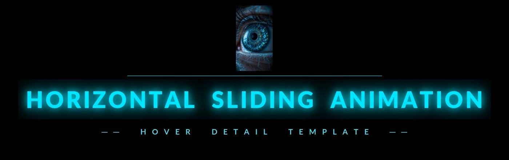

<p align="center">
  
</p>

<p align="center">
  A single-page portfolio component built with vanilla HTML, CSS, and JavaScript. No frameworks. No build step.
</p>

---

## Architecture

The component is split into two panels rendered inside a single HTML document:

- **Gallery** — horizontally scrolling row of project cards with a custom cursor indicator driven by `mousemove`
- **Detail panel** — slides in on hover/click and hosts two independently rendered views toggled by a pill switcher

The detail panel has two views:

- **Brief view** — impact metrics, bullet list, quick-grid role/stack summary, and a floating skills sidebar animated with a collision-resolved `requestAnimationFrame` loop
- **Technical view** — a dynamically built architecture flow diagram with clickable service nodes that open a detail card, a key decisions accordion with height-animated expand/collapse, and outcome stats

All content is driven by a single `projects` data object in `script.js`. No templating engine — DOM nodes are built and injected at runtime.

## Tech Stack

- HTML5 · CSS3 (custom properties, grid, flexbox, CSS transitions)
- Vanilla JavaScript (ES2020) — no dependencies
- Google Fonts: Space Grotesk · JetBrains Mono · Syne
- Material Icons (icon font)

## Usage

Open `index.html` directly in a browser, or serve the folder with any static server:

```bash
npx serve .
# or
python3 -m http.server 8080
```

## Customisation

All content is declared in the `projects` object at the top of `script.js`. Each key maps to one gallery card and controls every field rendered in both views. Swap the images in `images/` and update the data object to populate your own content.
